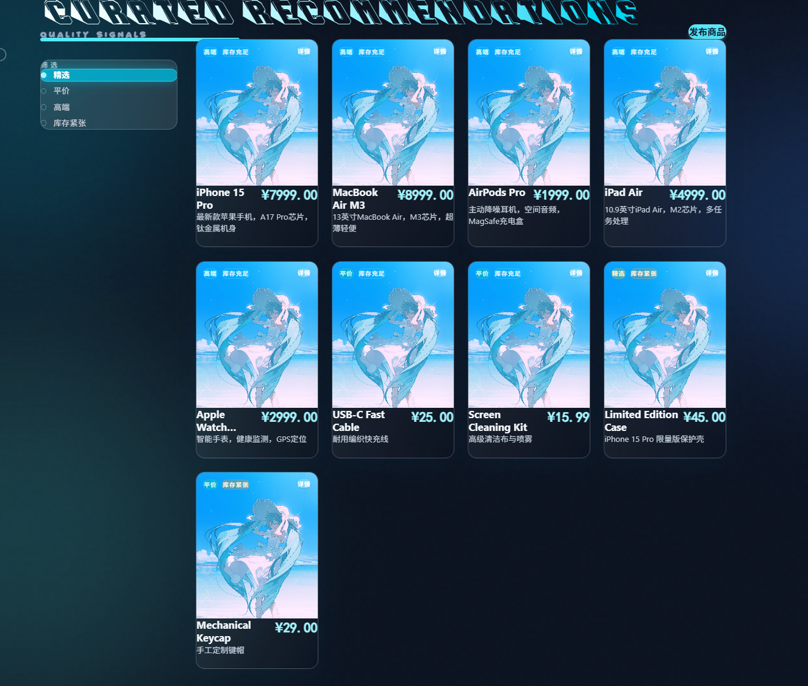

# Mercurial's Shop

姓名：肖湘玺  
学号：202330451951

[](https://skillicons.dev)

一个偏“未来感”的电商演示项目，包含顾客侧与销售管理侧的完整闭环。

## 亮点
- SMTP 订单邮件通知（下单后自动发送确认邮件）
- 顾客 / 销售管理 双角色体系（权限与页面入口差异化）
- 销售管理面板：订单列表、热卖排行、销售统计可视化
- 实时库存扣减（立即购买 / 购物车结算）
- 玻璃拟态 + 动效界面，商品标签分级展示与字体设计
- 部署支持 HTTPS（Nginx + Let's Encrypt）

## 核心功能
- 顾客：注册 / 登录 / 注销、商品浏览、购物车、下单、订单状态与历史
- 销售管理：上架商品、删除 / 编辑库存价格、订单查看、销售报表

## 目录结构
```
web_application/
├─ shop-backend/          # Spring Boot 后端
│  ├─ src/main/java/       # Java 源码（Controller/Service/Repository/Model）
│  │  └─ com/example/shop_backend/
│  │     ├─ controller/    # 接口层（Auth/Product/Cart/Order）
│  │     ├─ service/       # 业务逻辑层（Auth/Product/Cart/Order/Email）
│  │     ├─ repository/    # 数据访问层（JPA）
│  │     ├─ model/         # 实体模型（User/Product/Order 等）
│  │     └─ config/        # 跨域等配置
│  ├─ src/main/resources/  # 配置文件与资源
│  └─ pom.xml              # Maven 依赖配置
├─ shop-frontend/         # React + Vite 前端
│  ├─ src/                 # 前端页面与组件
│  │  ├─ components/       # 组件（ProductList/SellerDashboard/Cart 等）
│  │  ├─ services/         # API 请求封装
│  │  ├─ types/            # 类型定义
│  │  └─ assets/           # 静态资源
│  ├─ public/              # 静态资源
│  └─ package.json         # 依赖与脚本
├─ images/                # 报告与展示图片
├─ docker-compose.yml
└─ README.md
```

## 项目截图
系统架构图：  


前端商品页：  


## 一键运行（Docker）
在项目根目录执行：

```bash
docker compose up --build
```

- 前端：http://localhost:5173
- 后端：http://localhost:8080

如需邮件发送，请设置环境变量：

```bash
SMTP_USER=你的邮箱
SMTP_PASS=你的授权码
```

> 默认使用 MySQL 容器；邮箱配置通过环境变量注入。

## 本地开发（可选）
- 后端：`shop-backend`（Spring Boot）
- 前端：`shop-frontend`（Vite + React）

需要 Node.js 18+ / Java 21+ / MySQL 8+
