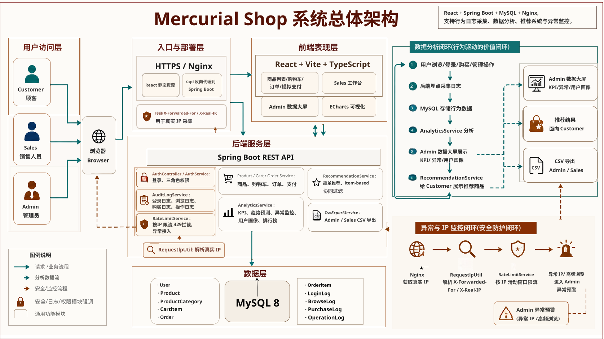
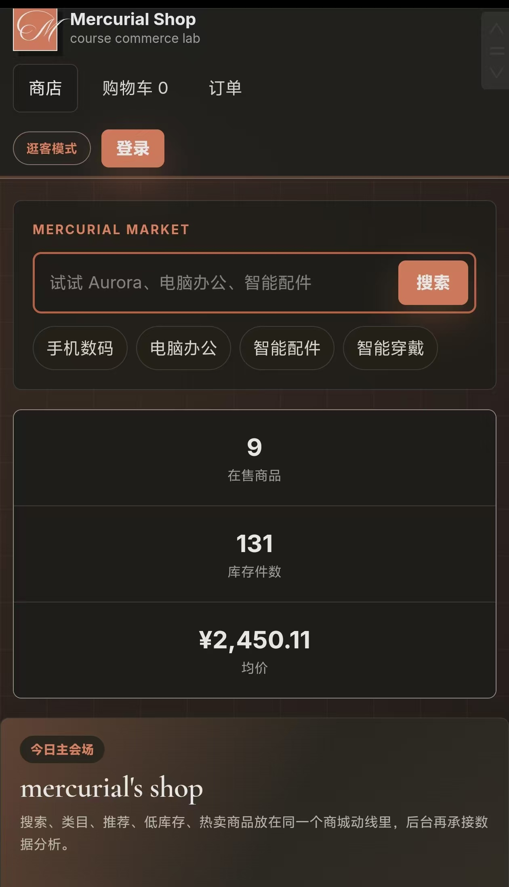
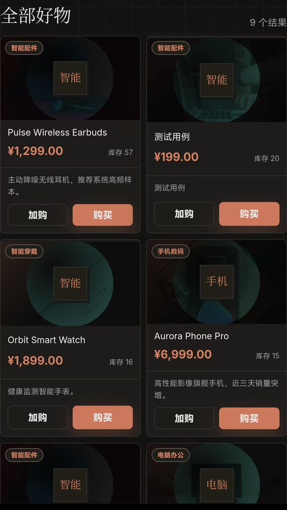
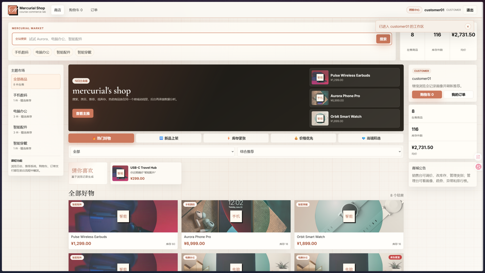

# Mercurial's Shop

姓名：肖湘玺  
学号：202330451951

[](https://skillicons.dev)

Mercurial's Shop 是一个完整的电商演示系统，覆盖顾客购物、销售管理、平台运营、数据分析和线上部署。项目采用前后端分离架构：前端由 React + TypeScript + Vite 构建，后端基于 Spring Boot + Spring Data JPA，数据持久化使用 MySQL，并以 Docker Compose 作为唯一推荐的运行与部署入口。

**线上部署地址：** <https://www.mercuria1.top/>

## 功能概览

| 角色 | 能力 |
| --- | --- |
| 顾客 | 注册登录、商品浏览、关键词搜索、分类筛选、购物车、立即购买、订单支付、订单详情、个性化推荐 |
| 销售 | 商品上架、编辑商品、删除商品、库存与价格维护、商品分类管理、订单查看、销售统计、CSV 导入导出 |
| 管理员 | 销售账号管理、密码重置、演示数据重置、登录/浏览/购买/操作日志、销售趋势、异常监控、客户画像 |

## 项目亮点

- 多角色权限体系：顾客、销售、管理员拥有独立入口和工作台。
- 完整交易闭环：浏览、加购、下单、支付、库存扣减、订单追踪一体化。
- 响应式移动端适配：首页、商品列表、推荐内容和关键操作在手机端保持清晰可用。
- 数据分析面板：销售额、订单量、热卖排行、趋势图、异常行为和客户画像可视化。
- 推荐能力：结合浏览与购买日志生成用户推荐和相似商品推荐。
- CSV 工具链：销售端支持商品批量导入，管理员和销售端支持报表导出。
- 审计日志：记录登录、浏览、购买和关键后台操作，便于验收和问题追踪。
- 反爬与异常识别：后端包含访问频率限制、IP 解析和异常数据聚合。
- 邮件通知：支持 SMTP 订单邮件通知，可通过环境变量配置。
- 生产部署：推荐使用 Docker Compose 编排 MySQL、Spring Boot 后端和 Nginx 前端容器。

## 技术栈

| 层级 | 技术 |
| --- | --- |
| 前端 | React 19、TypeScript、Vite/Rolldown、React Router、ECharts、Framer Motion |
| 后端 | Java 21、Spring Boot 4、Spring Web MVC、Spring Data JPA、Spring Mail、Spring Security Crypto |
| 数据库 | MySQL 8 |
| 部署 | Docker Compose、Nginx、Let's Encrypt、Ubuntu |

## 系统预览

### 系统架构



### 移动端适配预览

移动端页面针对窄屏场景调整了导航、商品卡片、推荐内容和操作按钮布局，核心购物流程可在手机浏览器中连续完成。

| 首页移动端 | 商品与推荐移动端 |
| --- | --- |
|  |  |

### 顾客商品与推荐页面



## 目录结构

```text
web_application/
├─ shop-backend/             # Spring Boot 后端服务
│  ├─ src/main/java/          # Controller / Service / Repository / Model
│  ├─ src/main/resources/     # 应用配置
│  └─ pom.xml
├─ shop-frontend/            # React + TypeScript 前端
│  ├─ src/components/         # 复用组件
│  ├─ src/views/              # 顾客、销售、管理员页面
│  ├─ src/services/           # API 请求封装
│  ├─ src/routes/             # 前端路由
│  └─ package.json
├─ deploy/nginx/              # 服务器 Nginx 站点配置参考
├─ images/                    # README 展示图片
├─ docker-compose.yml
└─ README.md
```

## 快速启动

使用 Docker Compose 启动完整环境。第一次运行前先复制环境变量模板，并修改数据库密码：

```bash
cp .env.example .env
nano .env
docker compose up --build -d
docker compose ps
```

默认服务地址：

| 服务 | 地址 |
| --- | --- |
| 前端 | <http://localhost:5173> |
| 后端 | <http://localhost:8080> |
| MySQL | `localhost:3306` |

`.env` 中的数据库账号和密码由 MySQL 容器首次初始化时创建：

```env
MYSQL_DATABASE=shop_db
MYSQL_USER=shop_user
MYSQL_PASSWORD=change-me-shop-pass
MYSQL_ROOT_PASSWORD=change-me-root-pass
```

订单邮件通知默认关闭，不影响下单流程。如需启用，在 `.env` 中设置：

```env
APP_MAIL_ENABLED=true
SMTP_HOST=smtp.qq.com
SMTP_PORT=465
SMTP_USER=your-email@example.com
SMTP_PASS=your-smtp-token
```

## 本地开发

推荐直接使用 Docker Compose 启动完整环境。需要单独开发前端或后端时，再使用本机 Node.js、Java 与 MySQL。

环境要求：

| 工具 | 版本建议 |
| --- | --- |
| Node.js | 20+ |
| Java | 21+ |
| Maven | 使用后端目录内的 `mvnw` |
| MySQL | 8+ |

启动后端：

```bash
cd shop-backend
./mvnw spring-boot:run
```

启动前端：

```bash
cd shop-frontend
npm install
npm run dev
```

本地 MySQL 默认连接信息：

| 项目 | 值 |
| --- | --- |
| 地址 | `127.0.0.1` |
| 端口 | `3307` |
| 数据库 | `shop_db` |
| 用户 | `shop_user` |
| 密码 | `shop_pass` |

## 演示账号

| 角色 | 用户名 | 密码 | 用途 |
| --- | --- | --- | --- |
| 管理员 | `admin` | `admin123` | 查看运营分析、日志、异常和销售账号管理 |
| 销售 | `seller01` | `seller123` | 管理商品、分类、库存、订单和 CSV 报表 |
| 顾客 | `customer01` | `customer123` | 浏览商品、购物车、下单、支付和推荐 |

## 生产部署说明

推荐线上部署结构：

```text
Docker Compose
├─ frontend      -> Nginx 托管 React build，并反向代理 /api/
├─ backend       -> Spring Boot API
└─ db            -> MySQL 8
```

容器内前端 Nginx 配置位于 `shop-frontend/nginx.conf`。服务器外层 HTTPS 反代可参考 `deploy/nginx/mercurial-shop.conf`。部署时需要确认：

- 域名已解析到服务器。
- Docker 与 Docker Compose 可用。
- 数据库密码、SMTP 账号等敏感配置通过服务器本地 `.env` 注入。
- `/api/` 正确反向代理到后端服务。

推荐部署流程：

```bash
git pull
cp .env.example .env
nano .env
docker compose config
docker compose up --build -d
docker compose ps
```

后续更新代码时无需覆盖已有 `.env`，直接拉取并重建：

```bash
git pull
docker compose up --build -d
docker compose ps
```

常用 Docker 变量：

| 变量 | 默认值 | 说明 |
| --- | --- | --- |
| `MYSQL_DATABASE` | `shop_db` | MySQL 数据库名 |
| `MYSQL_USER` | `shop_user` | 应用数据库用户 |
| `MYSQL_PASSWORD` | `shop_pass` | 应用数据库密码 |
| `MYSQL_ROOT_PASSWORD` | `root` | MySQL root 密码 |
| `FRONTEND_PORT` | `5173` | 前端容器映射到宿主机的端口 |
| `APP_MAIL_ENABLED` | `false` | 是否启用订单邮件通知 |
| `SMTP_HOST` / `SMTP_PORT` | `smtp.qq.com` / `465` | SMTP 服务地址和端口 |
| `SMTP_USER` / `SMTP_PASS` | 空 | 订单邮件账号和授权码，关闭邮件时可留空 |

示例 `.env`：

```env
MYSQL_DATABASE=shop_db
MYSQL_USER=shop_user
MYSQL_PASSWORD=replace-with-a-strong-password
MYSQL_ROOT_PASSWORD=replace-with-a-strong-root-password
FRONTEND_PORT=5173

APP_MAIL_ENABLED=false
SMTP_HOST=smtp.qq.com
SMTP_PORT=465
SMTP_USER=
SMTP_PASS=
```
